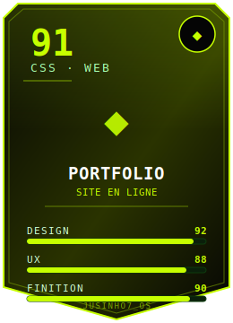
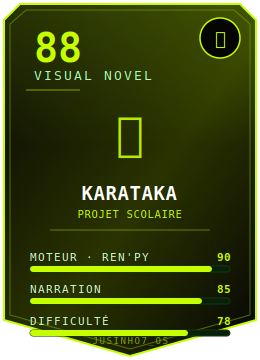
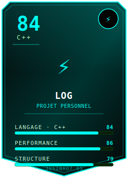
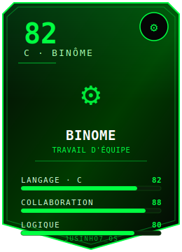
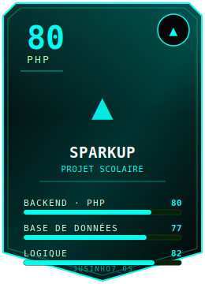
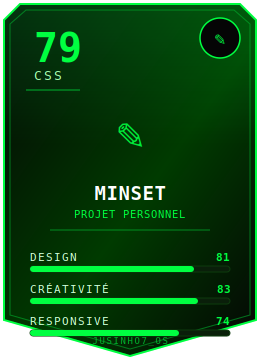

<div align="center">


<a href="https://github.com/Jusinho7">
  
</a>

<br/>


</div>

<br/>

<div align="center">

</div>

<br/>

```ansi
[38;5;46mroot@jusinho7[0m:~$ [38;5;46mneofetch[0m
────────────────────────────────────────────────
[38;5;46mOS[0m          : Jusinho7 OS x86_64 [Student Edition]
[38;5;46mHost[0m        : GitHub Cloud (Profile Instance)
[38;5;46mKernel[0m      : passion-driven-6.9.dev
[38;5;46mUptime[0m      : depuis mon premier "Hello World"
[38;5;46mShell[0m       : curiosity --interactive
[38;5;46mTerminal[0m    : VS Code / Konsole
[38;5;46mDE[0m          : Matrix-UI
[38;5;46mCPU[0m         : Café-powered Core™
[38;5;46mMemory[0m      : idées infinies / compilation en cours
[38;5;46mLanguages[0m   : C, C++, PHP, HTML, CSS, Ren'Py
```

---

<div align="center">

## 📁 Explorateur de fichiers — `/home/jusinho7`

*Cliquez sur un dossier pour l'ouvrir*

</div>

<details open>
<summary>📂 <b>about-me/</b></summary>
<br/>

```yaml
# ~/about-me/profile.yaml
name:        Jusinho7
role:        Étudiant Développeur
languages:   [C, C++, PHP, HTML, CSS, Ren'Py]
currently:   "Apprendre, construire, casser, réparer, recommencer"
motto:       "sudo make me a better developer"
```

</details>

<details>
<summary>📂 <b>tech-stack/</b></summary>
<br/>

<div align="center">


<br/>


</div>

</details>

<details open>
<summary>📂 <b>projects/</b> — <i>6 items · vue cartes</i></summary>
<br/>

<div align="center">

<table>
<tr>
<td align="center"></td>
<td align="center"></td>
<td align="center"></td>
</tr>
<tr>
<td align="center"></td>
<td align="center"></td>
<td align="center"></td>
</tr>
</table>

</div>

</details>

<details>
<summary>📂 <b>stats/</b> — <i>live data</i></summary>
<br/>

<div align="center">


</div>

> 🐍 Pour ajouter le **serpent animé** qui mange vos contributions : créez un dépôt `Jusinho7/Jusinho7` avec une GitHub Action (`.github/workflows/snake.yml`), puis intégrez :
> ```md
> 
> ```

</details>

<details>
<summary>📂 <b>contact.sh</b> — <i>executable</i></summary>
<br/>

<div align="center">

[](mailto:lucasjusinho@gmail.com)
[](https://github.com/Jusinho7)

</div>

</details>

---

<div align="center">

```ansi
[38;5;46mroot@jusinho7[0m:~$ echo "Merci de votre visite ✨"
Merci de votre visite ✨

[38;5;46mroot@jusinho7[0m:~$ [7m [0m
```


</div>
